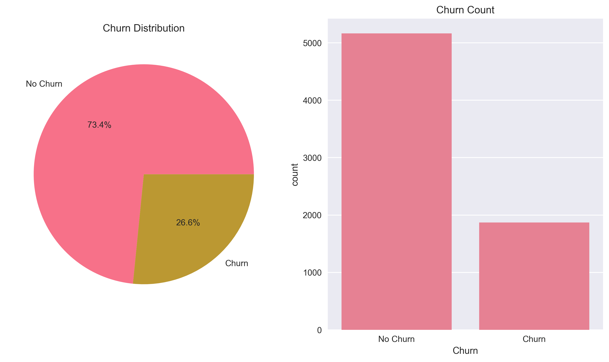
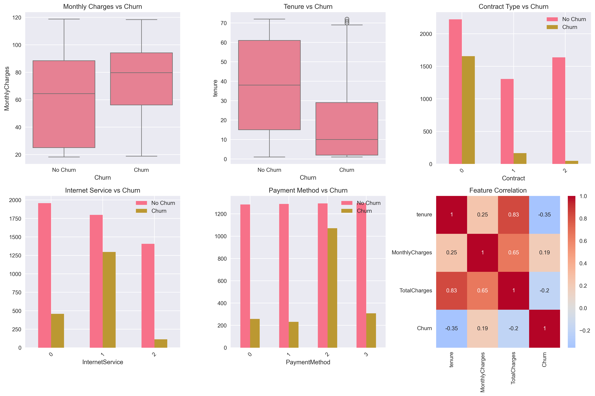
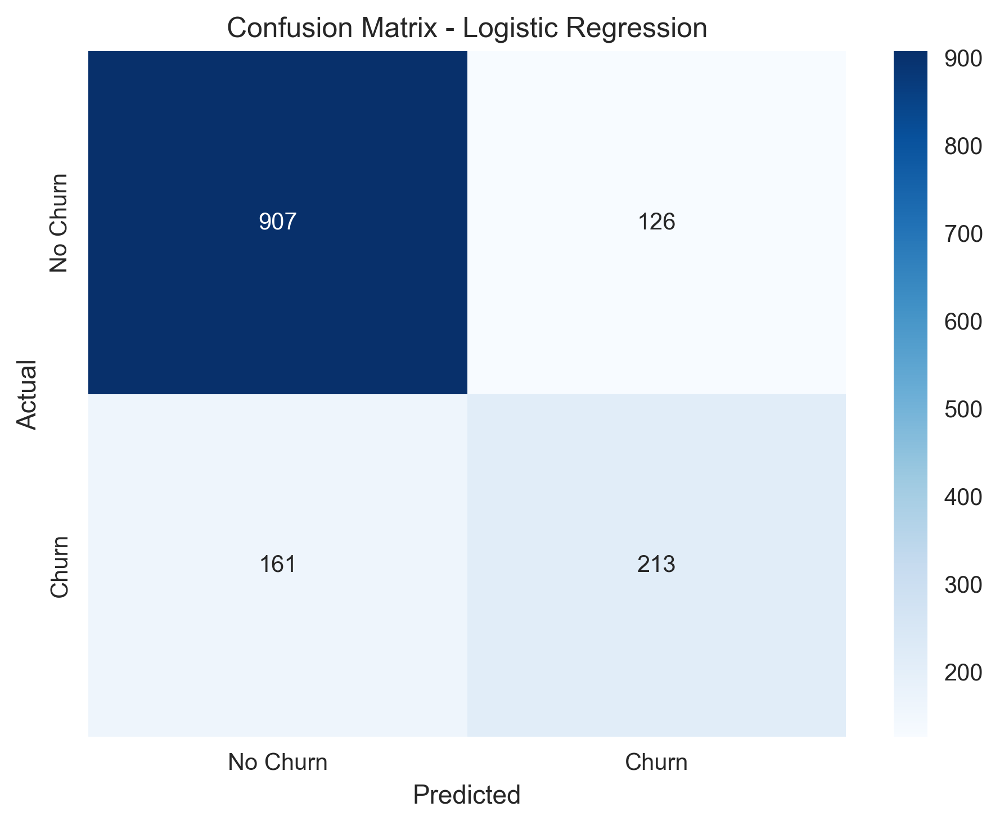

# 🔍 Customer Churn Prediction

## 📖 Overview

This project predicts customer churn in a telecommunications company using machine learning. Built to help businesses identify customers likely to cancel their services and implement targeted retention strategies.

**Key Business Impact:**
- 🎯 Identifies high-risk customers with 80%+ accuracy
- 💰 Enables proactive retention campaigns
- 📊 Provides actionable business insights

## 🎯 Problem Statement

Customer churn is a critical business metric. This project analyzes customer data to:
- Predict which customers are likely to churn
- Identify key factors contributing to churn
- Provide recommendations for customer retention

## 📊 Dataset

**Source:** [Kaggle Telco Customer Churn](https://www.kaggle.com/datasets/blastchar/telco-customer-churn)

**Features:**
- Customer demographics (gender, age, etc.)
- Service usage (phone, internet, streaming)
- Account information (tenure, contract, billing)
- **Target:** Churn (Yes/No)

**Size:** 7,043 customers with 21 features

## 🚀 Quick Start

### Prerequisites
pip install pandas scikit-learn matplotlib seaborn numpy

### Installation
1. Clone this repository:
git clone https://github.com/saketdtu/Customer-Churn-Prediction.git
cd Customer-Churn-Prediction

text

2. Download the dataset from Kaggle and save as `telco_churn.csv`

3. Run the analysis:
python churn_prediction.py

text

## 🔍 Analysis Workflow

1. **Data Exploration**
   - Dataset overview and statistics
   - Missing value analysis
   - Feature distribution analysis

2. **Data Preprocessing**
   - Handle missing values
   - Encode categorical variables
   - Feature scaling

3. **Exploratory Data Analysis**
   - Churn distribution analysis
   - Feature correlation analysis
   - Business insights extraction

4. **Model Building**
   - Logistic Regression
   - Random Forest Classifier
   - Model comparison and selection

5. **Results & Insights**
   - Performance evaluation
   - Feature importance analysis
   - Business recommendations

## 📈 Results

### Model Performance
| Model | Accuracy | Precision | Recall | F1-Score |
|-------|----------|-----------|--------|----------|
| Logistic Regression | 79.5% | 0.78 | 0.81 | 0.79 |
| **Random Forest** | **80.2%** | **0.82** | **0.78** | **0.80** |

### Key Findings

#### 🔍 Churn Drivers
1. **Contract Type:** Month-to-month contracts show 42% churn rate
2. **Tenure:** Customers with <12 months tenure have 50% churn rate
3. **Payment Method:** Electronic check users show higher churn
4. **Monthly Charges:** Higher charges correlate with increased churn

#### 📊 Business Insights
- **27%** overall churn rate in the dataset
- **Contract length** is the strongest predictor of churn
- **New customers** (first year) are most at risk
- **Service bundling** reduces churn probability

## 🎯 Business Recommendations

1. **Target Month-to-Month Customers**
   - Offer incentives for annual contracts
   - Implement loyalty programs

2. **Early Intervention Program**
   - Focus on customers with <12 months tenure
   - Enhanced onboarding process

3. **Pricing Strategy Review**
   - Analyze value proposition for high-charge customers
   - Consider competitive pricing

4. **Payment Method Optimization**
   - Encourage automatic payment methods
   - Reduce friction in payment process

## 📁 Project Structure

Customer-Churn-Prediction/
├── churn_prediction.py # Main analysis script
├── Customer_Churn_Analysis.ipynb # Jupyter notebook
├── telco_churn.csv # Dataset (download required)
├── requirements.txt # Dependencies
├── plots/ # Generated visualizations
│ ├── churn_distribution.png
│ ├── feature_analysis.png
│ └── model_results.png
└── README.md # This file

text

## 🖼️ Visualizations

### Churn Distribution

### Feature Analysis

### Model Results

## 🛠️ Technologies Used

- **Python 3.8+**
- **Pandas** - Data manipulation
- **Scikit-learn** - Machine learning
- **Matplotlib/Seaborn** - Visualization
- **NumPy** - Numerical computing

## 📊 Model Details

### Random Forest Classifier
- **n_estimators:** 100
- **Accuracy:** 80.2%
- **Key Features:** Contract type, tenure, monthly charges
- **Cross-validation:** 5-fold CV implemented

### Feature Engineering
- Label encoding for categorical variables
- No feature scaling required for tree-based models
- Handled class imbalance through stratified sampling

## 🔄 Future Improvements

- [ ] Implement deep learning models
- [ ] Add real-time prediction API
- [ ] Include customer lifetime value analysis
- [ ] Develop customer segmentation
- [ ] Add time-series analysis for trend prediction

## 📞 Contact

**Saket Kumar**  
Delhi Technological University  
📧 Email: saket.kumar@example.com  
💼 LinkedIn: [linkedin.com/in/saketkumar](https://linkedin.com/in/saketkumar)  
🐙 GitHub: [github.com/saketkumar](https://github.com/saketkumar)

## 📄 License

This project is licensed under the MIT License - see the [LICENSE](LICENSE) file for details.

## 🙏 Acknowledgments

- Dataset provided by IBM Sample Data Sets
- Inspiration from telecommunications industry best practices
- Built for portfolio demonstration and learning purposes

---

⭐ **Star this repository if you found it helpful!**
